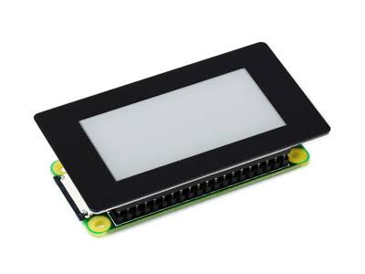
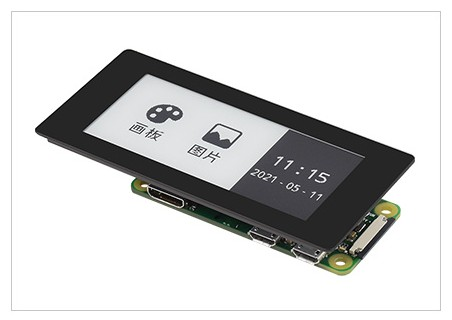

# 2.13" & 2.9" Touch e-Paper HAT for RP2350-PiZero 📝👆

## ℹ️ About

This project is a dedicated driver and graphics implementation for the **Waveshare 2.13" & 2.9" Touch e-Paper HATs** running on the **RP2350-PiZero** (Raspberry Pi Pico 2 form factor). 

The goal of this repository is to provide a "plug-and-play" experience for developers looking to create low-power, interactive e-Paper interfaces. It includes a custom **Gallery Application** that demonstrates real-time capacitive touch interaction, allowing users to navigate through different graphics scenes with simple taps. Whether you are building a smart home controller, a digital name tag, or a minimalist dashboard, this library provides the foundation for high-performance e-Ink UI on the latest RP2350 silicon.

---

## 🚀 Features

- 🖼️ **Broad EPD Support**: 
  - 2.13" e-Paper (V2, V3, V4)
  - 2.9" e-Paper (V2)
- 👆 **Interactive Touch**:
  - Integrated drivers for **GT1151** and **ICNT86X** touch controllers.
  - Coordinate mapping and gesture support.
- 🎨 **Rich GUI Library**:
  - Primitives: Points, Lines, Rectangles, Circles.
  - Text: Support for English and Chinese fonts (Multiple sizes).
  - Images: Display monochrome bitmaps.
- 🔄 **Smart Refresh**:
  - **Full Refresh**: For clear, ghost-free updates.
  - **Partial Refresh**: For fast, incremental updates (ideal for interactive UI).
- 🛠️ **Platform**:
  - Built exclusively for **Pico SDK** (RP2350/RP2040).

---

## 🛒 Purchasing Links

Build your own with these official Waveshare modules:
- **Display (2.13")**: [2.13" Touch e-Paper HAT](https://www.waveshare.com/2.13inch-touch-e-paper-hat.htm) 📝
- **Display (2.9")**: [2.9" Touch e-Paper HAT](https://www.waveshare.com/2.9inch-touch-e-paper-hat.htm) 📝
- **Controller**: [RP2350-PiZero (Pico 2 Form Factor)](https://www.waveshare.com/rp2350-pizero.htm) 🍓

---

## 🛠️ Hardware Configuration

### Pin Mapping (RP2350 / Pico 2)

| Component | Pin | Function |
| :--- | :--- | :--- |
| **e-Paper (SPI)** | GP11 | MOSI |
| | GP10 | SCK |
| | GP8 | CS |
| | GP25 | DC |
| | GP17 | RST |
| | GP24 | BUSY |
| **Touch (I2C)** | GP2 | SDA |
| | GP3 | SCL |
| | GP22 | TRST (Reset) |
| | GP27 | INT (Interrupt) |

---

## 📂 Project Structure

- **`examples/`**: Main test code and sample applications.
- **`lib/Config/`**: Hardware Abstraction Layer (SPI, I2C, GPIO, Delay).
- **`lib/Driver/`**: Touch screen controller drivers (**GT1151**, **ICNT86X**).
- **`lib/EPD/`**: Core e-Paper display drivers for various versions.
- **`lib/Fonts/`**: ASCII and Chinese fonts (8/12/16/20/24 px).
- **`lib/GUI/`**: Graphics library for drawing and image handling.

---

## 🔨 How to Build

### For Raspberry Pi Pico 2 (RP2350) 🍓

#### **Windows (PowerShell)**
1. Ensure the **Pico SDK** and **ARM GCC** toolchain are installed.
2. Open PowerShell and run:
   ```powershell
   mkdir build
   cd build
   cmake -G "Ninja" ..
   cmake --build .
   ```

#### **Linux / macOS**
1. Ensure the **Pico SDK** is installed and configured.
2. Run:
   ```bash
   mkdir build && cd build
   cmake ..
   make
   ```

3. Flash the resulting `epaper_touch.uf2` to your board.

---

## 🎨 Example Usage

The default `main.c` demonstrates a **Gallery Application** on the 2.13" V4 e-Paper:
- **Navigation**: Tap the left side (`<`) or right side (`>`) of the screen to switch between scenes.
- **Scenes**: Renders various shapes (House, Robot, Car) using the GUI library.
- **UI**: Displays page indicators and interactive buttons.

---

## 📷 Screenshots


*Waveshare RP2350-PiZero*


*2.13inch Touch e-Paper HAT*


*2.9inch Touch e-Paper HAT*

---

## 📄 License
This project is based on Waveshare's open-source drivers and is provided for educational and development purposes.
